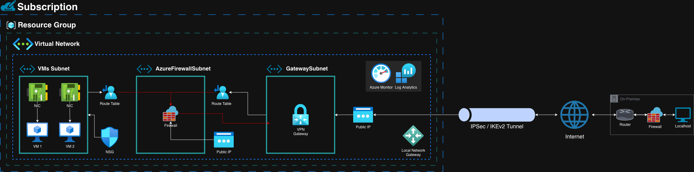

# Site to Site VPN from On-premises to Azure



## Prerequisites 

**Azure CLI Installed**

```bash
az version
```
 **Azure Account and Subscription**

```bash
az account set --subscription "SUBSCRIPTION_NAME_OR_ID"
```
 **Logged-In Azure Session**

```bash
az login
```
**Bash-Compatible Shell (for Line Continuation)**

The script uses backslashes (\) for multi-line commands, which work in Bash shells. <br> However if you are on Windows CMD, use caret (^) and use backtick (\`) on PowerShell.

**Required Permissions and Quotas**

Ensure your Azure account has permission to:

  * Create Resource Groups
  * Deploy Virtual Networks, Subnets, NSGs, VPN Gateways, and VMs

Also make sure your region (e.g., eastus) has enough quota for:

  * Virtual CPUs
  * Public IPs
  * Gateway SKUs

You can check resource usage with: `az vm list-usage-location eastus`

**On-premise Details**

While corporate networks typically use larger ranges like `10.0.0.0/8` (Class A), this guide uses a Class C CIDR range (`192.168.0.0/24`) for the local network in order to simplify the examples and make it easier to distinguish between on-premises and Azure IPs. 

Also, the public IP is assumed to be `203.113.45.78`.

-----

## Configuring the Site-to-Site VPN Connection

#### Create a Resource Group

```bash
az group create --name myResourceGroup --location eastus
```

#### Create a VNET with a dedicated Subnet for VPN Gateway

```bash
az network vnet create \
--name myVNet \
--resource-group myResourceGroup \
--location eastus \
--address-prefix 10.0.0.0/16 \
--subnet-name "Gateway Subnet" \
--subnet-prefix 10.0.200.0/27
```

#### Create a Subnet for VMs

```bash
az network vnet subnet create \
--name mySubnet \
--resource-group myResourceGroup \
--vnet-name myVNet \
--address-prefix 10.0.1.0/24
```

#### Create a Public IP for Virtual Network Gateway

As of the end of September 2025, basic SKU will be retired.

```bash
az network public-ip create \
--resource-group myResourceGroup \
--name myVNetGatewayPIP \
--allocation-method Static \
--sku Standard
```

#### Create Virtual Network Gateway

Gateway creation may take as long as 45 minutes. Using `--no-wait` lets the script move on immediately without waiting.

```bash
az network vnet-gateway create \
--resource-group myResourceGroup \
--name myVNetGateway \
--public-ip-address myVNetGatewayPIP \
--vnet myVNet \
--gateway-type Vpn \
--vpn-type RouteBased \
--sku VpnGw1 \
--location eastus \
--no-wait
```

#### Create Local Network Gateway

```bash
az network local-gateway create \
--resource-group myResourceGroup \
--name myLocalNetworkGateway \
--gateway-ip-address 203.113.45.78 \
--local-address-prefixes 192.168.0.0/24 \
--location eastus
```

#### Create a Network Security Group (NSG)

```bash
az network nsg create \
--resource-group myResourceGroup \
--name myNSG
```

#### Allow SSH from on-premises

```bash
az network nsg rule create \
--name Allow-SSH-VPN \
--resource-group myResourceGroup \
--nsg-name myNSG \
--protocol Tcp \
--direction Inbound \
--source-address-prefix 192.168.0.0/24 \
--source-port-range "*" \
--destination-address-prefix "*" \
--destination-port-range 22 \
--access Allow \
--priority 100
```

#### Allow RDP from on-premises

```bash
az network nsg rule create \
--name Allow-RDP-From-OnPrem \
-resource-group myResourceGroup \
--nsg-name myNSG \
--protocol Tcp \
--direction Inbound \
--source-address-prefixes 192.168.0.0/24 \
--source-port-ranges '*' \
--destination-address-prefixes '*' \
--destination-port-ranges 3389 \
--access Allow \
--priority 110
```

#### Associate Network Security Groups (NSG) at the Subnet

```bash
az network vnet subnet update \
--name mySubnet \
--resource-group myResourceGroup \
--vnet-name myVNet \
--network-security-group myNSG
```

#### Create a Network Interface (NIC) without associating an NSG

The network security rules are enforced at the subnet level. <br> Therefore the `--network-security-group` parameter is not used.

```bash
az network nic create \
--name myNic \
--resource-group myResourceGroup \
--location eastus \
--vnet-name myVNet \
--subnet mySubnet
```

#### Create Linux VM attached to the NIC

```bash
az vm create \
--resource-group myResourceGroup \
--name myLinuxVM \
--nics myNic \
--image UbuntuLTS \
--admin-username azureuser \
--generate-ssh-keys \
--no-wait
```

#### Create VPN connection

Avoid hardcoding sensitive values like the shared key in staging or production environments. 
Instead, use secure methods such as environment variables, Azure Key Vault, or parameters. 
The VPN connection cannot be created until the virtual network gateway has finished provisioning.

```bash
az network vpn-connection create \
--resource-group myResourceGroup \
--name myVPNConnection \
--vnet-gateway1 myVNetGateway \
--local-gateway2 myLocalNetworkGateway \
--shared-key "YourSharedKey123"
```

#### Wait for Virtual Network Gateway to Provision

Although you can check whether the resource exists using the command below, it does not guarantee that it is fully provisioned or ready for use.

```bash
az resource wait \
--exists \
--resource-group myResourceGroup \
--name myVNetGateway \
--resource-type "Microsoft.Network/virtualNetworkGateways"
```

#### Check the VPN connection status

```bash
az network vpn-connection show \
--name myVPNConnection \
--resource-group myResourceGroup \
--query connectionStatus
```

-----

## Integrating the VPN with Azure Firewall

#### Create Azure Firewall Subnet

```bash
az network vnet subnet create \
--name "AzureFirewallSubnet" \
--resource-group myResourceGroup \
--vnet-name myVNet \
--address-prefix 10.0.100.0/24
```

#### Create a Public IP for Azure Firewall

```bash
az network public-ip create \
--name myFirewallPublicIP \
--resource-group myResourceGroup \
--sku Standard \
--location eastus \
--allocation-method Static
```

#### Create Azure Firewall

```bash
az network firewall create \
--name myAzureFirewall \
--resource-group myResourceGroup \
--location eastus
```

#### Create the firewall IP configuration

```bash
az network firewall ip-config create \
--firewall-name myAzureFirewall \
--name myFirewallConfig \
--public-ip-address myFirewallPublicIP \
--resource-group myResourceGroup \
--vnet-name myVNet
```

#### Retrieve the firewall private IP

```bash
FIREWALL_PRIVATE_IP=$(az network firewall show \
--name myAzureFirewall \
--resource-group myResourceGroup \
--query "ipConfigurations[0].privateIPAddress" \
--output tsv)
```

#### Create a Route Table

```bash
az network route-table create \
--name myRouteTable \
--resource-group myResourceGroup \
--location eastus
```

#### Add a route that sends all traffic through the firewall's private IP

```bash
az network route-table route create \
--resource-group myResourceGroup \
--route-table-name myRouteTable \
--name DefaultRoute \
--address-prefix 0.0.0.0/0 \
--next-hop-type VirtualAppliance \
--next-hop-ip-address $FIREWALL_PRIVATE_IP
```

#### Associate the Route Table to the subnet where your VMs are

```bash
az network vnet subnet update \
--name mySubnet \
--resource-group myResourceGroup \
--vnet-name myVNet \
--route-table myRouteTable
```

#### Creating network rules for the firewall

The Azure Firewall operates on a default-deny principle, which means it will block all traffic.<br>Therefore traffic from your on-premises network will not be able to reach your VMs through the VPN tunnel unless a specific rule is created to allow it.

```bash
az network firewall network-rule collection create \
--firewall-name myAzureFirewall \
--resource-group myResourceGroup \
--collection-name AllowWeb \
--rule-name AllowWebRule \
--rule-type NetworkRule \
--action Allow \
--priority 100 \
--protocols TCP \
--source-addresses 192.168.0.0/24 \
--destination-addresses 10.0.1.0/24 \
--destination-ports 22 3389
```

-----

## Monitoring and Troubleshooting

Azure provides several built-in tools to help monitor performance and diagnose network issues.

#### Azure Monitor

It collects and analyzes telemetry data from both cloud and on-premises environments.

**Platform Metrics**

Platform metrics provide real-time performance data. Key metrics include:

  * Gateway Bandwidth: The amount of data flowing through the VPN tunnel.
  * Packet Count: The number of packets sent and received.
  * CPU Utilization: The processor usage of the VPN gateway instance.

**Log Analytics**

You can query detailed logs useful for diagnosing tunnel issues and also tracking security events. 

Key log insights include:

  * IKEv2 Security Associations: Status of the Internet Key Exchange protocol.
  * Tunnel Connectivity Events: Events related to the tunnel being connected or disconnected.
  * Routing and BGP Information: Details on how traffic is being routed.

**Sample KQL query to analyze gateway diagnostic logs**

```kql
AzureDiagnostics
| where ResourceProvider == "MICROSOFT.NETWORK"
| where Category == "GatewayDiagnosticLog"
| summarize Count = count() by OperationName
| order by Count desc
```

#### Network Watcher

It provides diagnostic and visualization tools like IP flow verify to help identify network issues.

**IP flow verify**

It checks whether a specific traffic flow is allowed or blocked by a Network Security Group (NSG).

```bash
az network watcher test-ip-flow \
--resource-group myResourceGroup \
--direction Inbound \
--protocol TCP \
--local 10.0.1.4 \
--remote 192.168.1.5 \
--local-port 443 \
--remote-port 12345 \
--nic-id <NIC_RESOURCE_ID>
```
-----

## 📚 Resources

- [Network Security Group vs Application Security Groups | Demo](https://www.youtube.com/watch?v=JlHpdi2_fEU)
- [Azure Site to Site VPN Step by Step | Intro + Configuration](https://www.youtube.com/watch?v=V_Oif0HCE_g)
- [Azure S2S VPN Setup & Troubleshooting (Network Watcher)](https://youtu.be/gtcGmG3c3YU?si=O5g72eFujz2R47pG)
- [Deploying a cost-effective site-to-site VPN to Azure](https://youtu.be/LYnv2g8Wk3E?si=0GOUOjnT_XZuD_nw)
- [How to Disable Internet Traffic for Azure VM using NSG](https://youtu.be/r2CPKpFO3TE?si=O12ix34bxSRzwzFf)
- [How to Set Up a Site-to-Site VPN with Azure | Basic VPN Gateway + Ubiquiti](https://youtu.be/AfEKT97392I?si=eKNbfA7mvmprZhIk)
- [Azure Networking, User Defined Routes, and Network Virtual Appliances](https://www.youtube.com/watch?v=Y7KwOesXJVY)
- [Azure Routing explained in plain English | User Defined Routes](https://youtu.be/PRD8LjK_ccg?si=IIAJLBtkzf_PYbF7)
- [Az VM create | Az VM create command](https://www.youtube.com/watch?v=tXLScLO-DRI)
- [Azure Site-to-Site VPN quick setup](https://www.youtube.com/watch?v=jtIekRm32fY)
- [Design Azure Application Gateway & Firewall](https://www.youtube.com/watch?v=hKgEjqTp8MI)
- [What is Azure Firewall Basic and How to Deploy it](https://youtu.be/m_Of72WkQw0?si=owqCUGZXKen98oPA)
- [What is Azure Monitor?](https://youtu.be/nhWvye214No?si=zoASwW1gZEjnV9qf)
- [How to check if resource exists using Azure CLI](https://www.youtube.com/watch?v=eSutaPE80PM)
- [Azure VNET | Azure NSG Tutorial | Adding NIC and NSG](https://www.youtube.com/watch?v=j78kn06_6oA)
- [AZ-104: VPN Gateways - Types, Policy-based & Route-based VPNs](https://www.youtube.com/watch?v=lgJyqCHGrwY)
- [AZ-104: How to Deploy VPN Gateways (Active/Standby & Active/Active)](https://www.youtube.com/watch?v=QrciUsD6L9k)
- [IP Sec VPN Fundamentals](https://www.youtube.com/watch?v=pXMZMD501A0)
- [Azure how to setup vnet, Subnet, Route Table, Internet, NSG - Part 1](https://www.youtube.com/watch?v=15amNny_kKI)
- [Palo Alto VPN - Site to Site step by step configuration (2024)](https://www.youtube.com/watch?v=KjkIVgW4Dms)
- [Amazing S2S VPN Site-to-Site Connection To Azure](https://www.youtube.com/watch?v=GPANrMczTz4)
- [Microsoft Learn | How to install the Azure CLI](https://learn.microsoft.com/en-us/cli/azure/install-azure-cli)
- [Medium | Secure Azure Site-to-Site Connectivity: A Cloud Security Project](https://medium.com/@gazalofficial30/secure-azure-site-to-site-connectivity-a-cloud-security-project-ea7fd232e575)
- [Microsoft Learn | Create S2S VPN connection between on-premises network and Azure](https://learn.microsoft.com/en-us/azure/vpn-gateway/tutorial-site-to-site-portal)
- [Microsoft Learn | About gateway SKUs](https://learn.microsoft.com/en-us/azure/vpn-gateway/about-gateway-skus)
- [Microsoft Learn | About active-active mode VPN gateways](https://learn.microsoft.com/en-us/azure/vpn-gateway/about-active-active-gateways#active-active-mode-design)
- [Microsoft Learn | About Azure VPN Gateway](https://learn.microsoft.com/en-us/azure/vpn-gateway/vpn-gateway-about-vpngateways)
- [Medium | Seamlessly Stitching the Cloud and On-Premises (Azure Site-to-Site Connection)](https://medium.com/@starswap_27606/seamlessly-stitching-the-cloud-and-on-premises-azure-site-to-sites-connection-elegance-63a6ae7d0070)
- [Andy Kemp | Cost effective IPSec Site to Site VPN with Azure and UDM](https://www.andykemp.com/2024/06/09/cost-effective-ipsec-site-to-site-vpn-with-azure-and-udm)
- [Microsoft Learn | az network nsg rule](https://learn.microsoft.com/en-us/cli/azure/network/nsg/rule?view=azure-cli-latest)
- [Cloud Curve | How to route site-to-site VPN traffic via Azure Firewall](https://cloudcurve.co.uk/azure/how-to-route-site-to-site-vpn-traffic-via-azure-firewall/)
- [Consulcat | Amazing S2S VPN Site-to-Site Connection To Azure](https://consulcat.com/en/amazing-s2s-vpn-site-to-site-connection-to-azure/)
